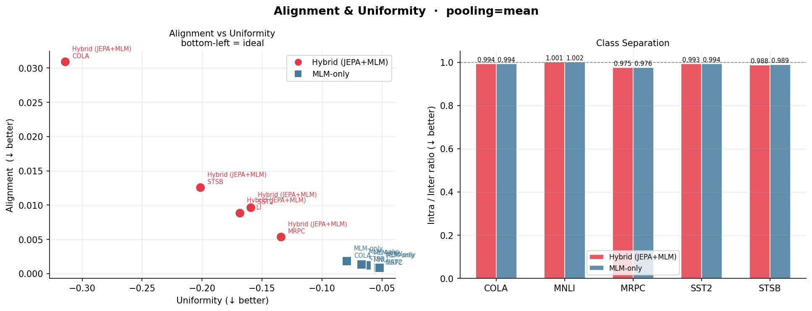

# Predict and Reconstruct
### Joint Objectives for Self-Supervised Language Representation Learning

> **Paper:** [Predict and Reconstruct: Joint Objectives for Self-Supervised Language Representation Learning](https://www.researchgate.net/publication/402467485_Predict_and_Reconstruct_Joint_Objectives_for_Self-Supervised_Language_Representation_Learning?channel=doi&linkId=69b8a4e6a685ad71ef8af8af&showFulltext=true) 
> **Author:** Aimen Boukhari — École Nationale Supérieure d'Informatique (ESI), Algiers

---

## Overview

This repository proposes a hybrid pre-training objective that combines a **JEPA-style latent prediction loss** with **masked language modelling (MLM)** over a single shared encoder. MLM alone incentivises the encoder to memorise surface-form token statistics; the JEPA branch pushes representations toward semantic abstraction by predicting latent targets rather than raw tokens.

Both a **hybrid model** (JEPA + MLM) and a **pure-MLM baseline** are trained under identical architectures and compute budgets, then systematically compared on five GLUE benchmarks using six geometric representation metrics and four pooling strategies.

---

## Architecture

```
Original Tokens ──────────────────────► Target Encoder (EMA, no grad)
                                                    │  h (target reps)
                                                    ▼
Masked Tokens ──► Shared Encoder (masks_enc) ──► Predictor ──► JEPA Loss
      │                    z                       z_pred      1 − cos(z_pred, h)
      │
      └──────► Shared Encoder (full seq) ──► Token Regressor ──► MLM Loss
                          z_full                                cross_entropy

                              L = λ · L_JEPA + (1−λ) · L_MLM
                                    λ = sigmoid(w)  ← learnable
```

The shared encoder is used for **both branches** — there is no separate BERT-style model. Both objectives share gradient signals through the same encoder weights.


---

## Repository Structure

```
T-JEPA/
├── config/
│   └── config.yaml                         # training configuration
├── src/
│   ├── dataset/
│   │   ├── data/text_data.py               # WikiText data loader
│   │   └── masks/all_masks.py              # block mask collator
│   ├── models/transformer/
│   │   ├── text_transformers.py            # encoder + predictor
│   │   └── text_embedding.py               # token + positional embeddings
│   ├── help/
│   │   ├── schedulers.py                   # init_model, init_opt, load_checkpoint
│   │   ├── utils.py                        # apply_masks, repeat_interleave_batch
│   │   └── logging.py                      # CSVLogger, AverageMeter
│   ├── evaluation/
│   │   ├── finetune_sentiment.py           # SST-2
│   │   ├── finetune_paraphrase.py          # MRPC / QQP
│   │   ├── finetune_mnli.py                # MNLI
│   │   ├── finetune_cola.py                # CoLA
│   │   └── finetune_stsb.py                # STS-B
│   └── scripts/
│       ├── representation_analysis.py      # 6 metrics × 4 pooling strategies
│          
└── train.py                                # pre-training entry point
```

---

## Installation

```bash
git clone https://github.com/aymen-000/predict-reconstruct-language-models.git
cd predict-reconstruct-language-models
pip install -r requirement.txt
```

---

## Pre-training

```bash
# Hybrid (JEPA + MLM)
python src/train.py --config config/config.yaml --mode hybrid

# MLM-only baseline
python src/train.py --config config/config.yaml --mode mlm

# Resume from checkpoint
python src/train.py --config config/config.yaml --mode hybrid --resume
```

Key settings in `config/config.yaml`:

```yaml
meta:
  model_name:   text_transformer_large
  pred_depth:   6
  pred_emb_dim: 512

data:
  vocab_size:  30522
  max_seq_len: 512
  batch_size:  64

mask:
  enc_mask_scale:  [0.65, 0.85]   # JEPA context mask
  pred_mask_scale: [0.10, 0.25]   # JEPA prediction targets
  num_pred_masks:  2

optimization:
  epochs: 3
  lr:     5.0e-5
  ema:    [0.996, 1.0]             # target encoder momentum
```

---

## Downstream Evaluation — Linear Probing

The encoder is **frozen** throughout; only a lightweight head is trained per task.

```bash
python src/evaluation/finetune_sentiment.py \
    --checkpoint outputs/text_jepa/text_jepa_experiment-final.pth.tar \
    --config config/config.yaml

python src/evaluation/finetune_paraphrase.py \
    --checkpoint outputs/text_jepa/text_jepa_experiment-final.pth.tar \
    --config config/config.yaml --dataset mrpc

python src/evaluation/finetune_mnli.py \
    --checkpoint outputs/text_jepa/text_jepa_experiment-final.pth.tar \
    --config config/config.yaml

python src/evaluation/finetune_cola.py \
    --checkpoint outputs/text_jepa/text_jepa_experiment-final.pth.tar \
    --config config/config.yaml

python src/evaluation/finetune_stsb.py \
    --checkpoint outputs/text_jepa/text_jepa_experiment-final.pth.tar \
    --config config/config.yaml
```

| Task | Metric | Hybrid | MLM-only |
|------|--------|--------|----------|
| SST-2 | Accuracy | 67.55 | **68.69** |
| MRPC | F1 | **63.09** | 59.84 |
| MNLI | Accuracy | 50.82 | **51.36** |
| STS-B | Spearman ρ | 0.281 | **0.283** |

> Results on official GLUE validation splits. Encoder frozen throughout.

---

## Representation Analysis

```bash
python src/scripts/representation_analysis.py \
    --hybrid_ckpt outputs/text_jepa/text_jepa_experiment-final.pth.tar \
    --mlm_ckpt    outputs/text_jepa_mlm/text_jepa_experiment-final.pth.tar \
    --tokenizer   bert-base-uncased \
    --datasets    sst2 mrpc mnli cola stsb \
    --pooling     mean max weighted attention \
    --output_dir  outputs/analysis
```

The hybrid encoder is consistently **5–10× more uniform** than MLM-only across all datasets and pooling strategies — the key geometric finding of the paper.

| Dataset | Pooling | Hybrid | MLM-only |
|---------|---------|--------|----------|
| SST-2 | attention | **−0.448** | −0.055 |
| CoLA | attention | **−0.955** | −0.083 |
| STS-B | attention | **−0.577** | −0.069 |

.png)



---

## Outputs

All results are saved under `outputs/`:

---

## Citation

```bibtex
@article{boukhari2025predictreconstruct,
  title   = {Predict and Reconstruct: Joint Objectives for
             Self-Supervised Language Representation Learning},
  author  = {Boukhari Aimen},
  year    = {2026}
}
```

---

## Acknowledgements

Architecture inspired by [I-JEPA](https://github.com/facebookresearch/ijepa) (Assran et al., CVPR 2023).  
